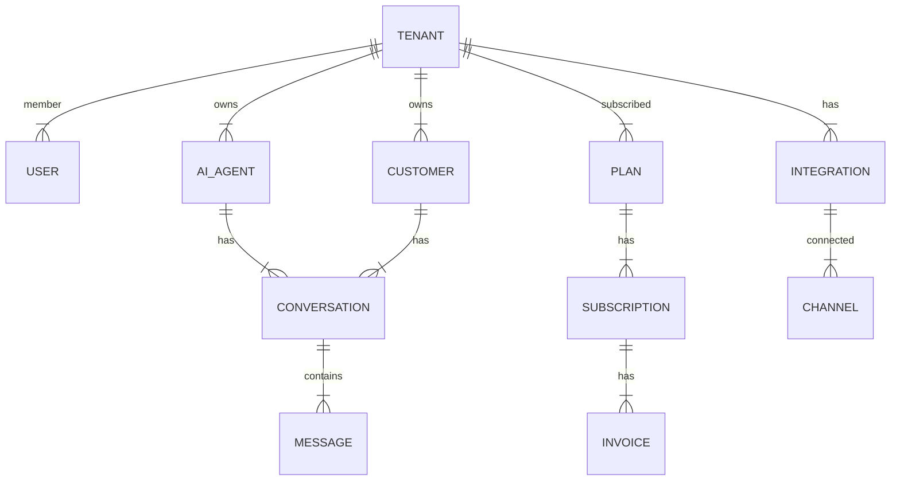

Berikut adalah rancangan arsitektur lengkap MVP untuk Agentic AI Employee Platform:
### Folder Structure
```markdown
agentic-ai-employee-platform/
├── backend/
│   ├── app/
│   │   ├── __init__.py
│   │   ├── auth/
│   │   ├── ai_agents/
│   │   ├── customers/
│   │   ├── integrations/
│   │   ├── billing/
│   │   ├── settings/
│   │   ├── models/
│   │   ├── schemas/
│   │   ├── services/
│   │   ├── repositories/
│   │   ├── utils/
│   │   ├── main.py
│   ├── config/
│   ├── requirements.txt
│   ├── Dockerfile
├── frontend/
│   ├── pages/
│   │   ├── dashboard/
│   │   ├── ai-agents/
│   │   ├── customers/
│   │   ├── integrations/
│   │   ├── billing/
│   │   ├── settings/
│   ├── components/
│   ├── utils/
│   ├── next.config.js
│   ├── package.json
├── database/
│   ├── schema.sql
│   ├── data.sql
├── docker-compose.yml
├── README.md
```
### ERD (Entity-Relationship Diagram)

### API Endpoints
#### Auth Module
* `POST /api/v1/auth/register`: Register tenant
* `GET /api/v1/auth/google/callback`: Google OAuth callback
* `POST /api/v1/auth/otp/send`: Send OTP
* `POST /api/v1/auth/otp/verify`: Verify OTP
* `POST /api/v1/auth/login`: Login
* `POST /api/v1/auth/refresh`: Refresh token
* `GET /api/v1/auth/me`: Get current user

#### Dashboard Module
* `GET /api/v1/dashboard/stats`: Get dashboard stats

#### AI Agents Module
* `GET /api/v1/ai-agents`: Get all AI agents
* `POST /api/v1/ai-agents`: Create new AI agent
* `GET /api/v1/ai-agents/{id}`: Get AI agent by ID
* `PUT /api/v1/ai-agents/{id}`: Update AI agent
* `DELETE /api/v1/ai-agents/{id}`: Delete AI agent
* `GET /api/v1/ai-agents/{id}/conversations`: Get conversations for AI agent
* `GET /api/v1/ai-agents/{id}/conversations/{conversation_id}/messages`: Get messages for conversation

#### Customers Module
* `GET /api/v1/customers`: Get all customers
* `GET /api/v1/customers/{id}`: Get customer by ID

#### Integrations Module
* `GET /api/v1/integrations`: Get all integrations
* `POST /api/v1/integrations`: Create new integration
* `GET /api/v1/integrations/{id}`: Get integration by ID
* `PUT /api/v1/integrations/{id}`: Update integration
* `DELETE /api/v1/integrations/{id}`: Delete integration

#### Billing Module
* `GET /api/v1/billing/plans`: Get all plans
* `GET /api/v1/billing/subscriptions`: Get all subscriptions
* `POST /api/v1/billing/upgrade`: Upgrade plan
* `GET /api/v1/billing/invoices`: Get all invoices

#### Settings Module
* `GET /api/v1/settings`: Get tenant settings
* `PUT /api/v1/settings`: Update tenant settings
* `GET /api/v1/settings/team`: Get team members
* `POST /api/v1/settings/team`: Create new team member
* `GET /api/v1/settings/team/{id}`: Get team member by ID
* `PUT /api/v1/settings/team/{id}`: Update team member
* `DELETE /api/v1/settings/team/{id}`: Delete team member
```
### Architecture Diagram
```mermaid
graph LR
    A[Client] -->|Request|> B[NGINX]
    B -->|Proxy|> C[Backend]
    C -->|Database|> D[PostgreSQL]
    C -->|Cache|> E[Redis]
    C -->|AI|> F[LangChain]
    C -->|Payment|> G[Midtrans/Xendit]
    C -->|Auth|> H[Google OAuth]
```
### Auth Flow
1. User clicks "Login" button
2. Redirect to Google OAuth page
3. User grants permission
4. Redirect to callback URL
5. Verify OTP
6. Login success

### Upgrade Flow
1. User clicks "Upgrade" button
2. Show plan comparison
3. User selects plan
4. Redirect to payment page
5. Payment success
6. Update subscription
7. Unlock features
```
Catatan: Ini adalah rancangan awal dan dapat berubah sesuai dengan kebutuhan dan persyaratan proyek. Pastikan untuk melakukan pengujian dan validasi sebelum mengimplementasikan rancangan ini.