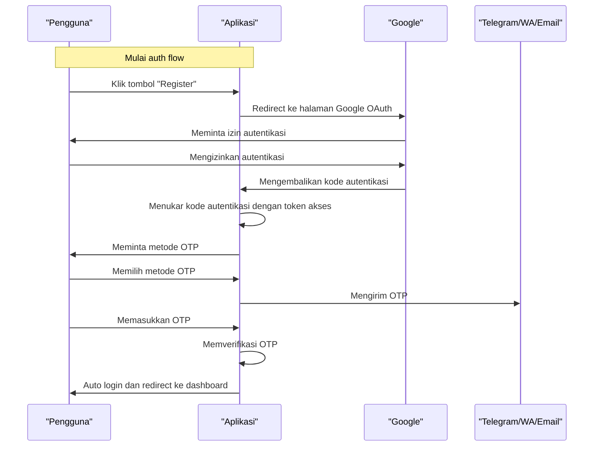

### Auth Flow Design
#### Overview
Auth flow menggunakan Google OAuth sebagai metode utama untuk autentikasi, dan OTP (One-Time Password) sebagai metode kedua untuk verifikasi identitas pengguna. OTP dapat dikirim melalui Telegram, WA, atau Email.

#### Langkah-Langkah Auth Flow
1. **Register**
 * Pengguna mengklik tombol "Register" dan diarahkan ke halaman Google OAuth
 * Pengguna memilih akun Google yang ingin digunakan untuk autentikasi
 * Google mengarahkan pengguna kembali ke aplikasi dengan kode autentikasi
2. **Google OAuth Callback**
 * Aplikasi menerima kode autentikasi dari Google dan menukarkannya dengan token akses
 * Aplikasi menyimpan token akses dan informasi pengguna di database
3. **OTP Request**
 * Pengguna diminta untuk memilih metode OTP (Telegram, WA, atau Email)
 * Pengguna memasukkan nomor telepon atau alamat email untuk menerima OTP
 * Aplikasi mengirim OTP ke pengguna melalui metode yang dipilih
4. **OTP Verification**
 * Pengguna memasukkan OTP yang diterima
 * Aplikasi memverifikasi OTP dan memastikan bahwa OTP cocok dengan yang dikirim
5. **Auto Login**
 * Jika OTP verifikasi berhasil, pengguna akan diarahkan ke dashboard aplikasi dan dilakukan auto login

#### API Endpoints
* **POST /api/v1/auth/register**: Menerima kode autentikasi dari Google dan menukarkannya dengan token akses
* **POST /api/v1/auth/otp/request**: Mengirim OTP ke pengguna melalui metode yang dipilih
* **POST /api/v1/auth/otp/verify**: Memverifikasi OTP yang dimasukkan oleh pengguna
* **GET /api/v1/auth/me**: Mengembalikan informasi pengguna yang sedang login

#### Database Schema
```sql
CREATE TABLE users (
  id SERIAL PRIMARY KEY,
  email VARCHAR(255) NOT NULL,
  name VARCHAR(255) NOT NULL,
  avatar VARCHAR(255),
  provider VARCHAR(255) NOT NULL,
  role VARCHAR(255) NOT NULL,
  verified BOOLEAN NOT NULL DEFAULT FALSE
);

CREATE TABLE otp_codes (
  id SERIAL PRIMARY KEY,
  user_id INTEGER NOT NULL REFERENCES users(id),
  channel VARCHAR(255) NOT NULL,
  code VARCHAR(255) NOT NULL,
  expires_at TIMESTAMP NOT NULL,
  used BOOLEAN NOT NULL DEFAULT FALSE
);
```

#### Auth Flow Diagram

Note: Diagram di atas menggunakan sintaks Mermaid untuk menggambarkan auth flow.